# Summary Microservice API

## Communication Contract

This microservice provides financial summary analytics by aggregating transaction data. It calculates income, expenses, savings, and net totals, with breakdowns by category. All communication is done via RESTful HTTP API endpoints.

---

## Base URL
```
http://localhost:5003
```

---

## How to REQUEST Data from the Microservice

The microservice accepts HTTP GET requests for summary data.

### 1. Get Current Month Summary
```bash
GET /summary
```

Returns a summary of all transactions for the current calendar month (from the 1st to today).

**Example Call:**
```python
import requests

# Get summary for current month
response = requests.get('http://localhost:5003/summary')
summary = response.json()
print(summary)
```

**Example using curl:**
```bash
curl http://localhost:5003/summary
```

### 2. Get Summary for Custom Date Range
```bash
GET /summary/range?start={YYYY-MM-DD}&end={YYYY-MM-DD}
```

Returns a summary of transactions within a custom date range. The `end` date is **exclusive** (not included in the range).

**Example Call:**
```python
import requests

# Get summary from January 1, 2024 to February 1, 2024 (excludes Feb 1)
params = {
    'start': '2024-01-01',
    'end': '2024-02-01'
}
response = requests.get('http://localhost:5003/summary/range', params=params)
summary = response.json()
print(summary)
```

**Example using curl:**
```bash
curl "http://localhost:5003/summary/range?start=2024-01-01&end=2024-02-01"
```

**Important Notes:**
- **Date Format**: Must be `YYYY-MM-DD`
- **End Date**: Is **exclusive** (transactions on the end date are NOT included)
- **Date Validation**: Start date must be before end date

---

## How to RECEIVE Data from the Microservice

The microservice returns JSON data with summary totals and category breakdowns.

### Success Response Format

Both endpoints return the same structure:

```json
{
  "period": {
    "start": "2024-01-01",
    "end_exclusive": "2024-02-01"
  },
  "totals": {
    "income": 5000.00,
    "expenses": 2500.00,
    "savings": 1000.00,
    "net": 1500.00
  },
  "by_category": [
    {
      "category": "Salary",
      "kind": "income",
      "total": 5000.00
    },
    {
      "category": "Groceries",
      "kind": "expense",
      "total": 800.00
    },
    {
      "category": "Emergency Fund",
      "kind": "savings",
      "total": 1000.00
    }
  ]
}
```

### Response Field Descriptions

**period** - The date range of the summary
- `start` (string) - Start date (inclusive) in YYYY-MM-DD format
- `end_exclusive` (string) - End date (exclusive) in YYYY-MM-DD format

**totals** - Aggregated financial totals
- `income` (number) - Total income in the period
- `expenses` (number) - Total expenses in the period
- `savings` (number) - Total savings in the period
- `net` (number) - Calculated as: `income - expenses - savings`

**by_category** - Array of category breakdowns (sorted by total DESC, then by name)
- `category` (string) - Name of the category
- `kind` (string) - Type: `"income"`, `"expense"`, or `"savings"`
- `total` (number) - Total amount for this category in the period

### Example: Processing the Response

```python
import requests

response = requests.get('http://localhost:5003/summary')

if response.status_code == 200:
    data = response.json()
    
    # Access period information
    period = data['period']
    print(f"Summary from {period['start']} to {period['end_exclusive']}")
    
    # Access totals
    totals = data['totals']
    print(f"\nFinancial Summary:")
    print(f"  Income:   ${totals['income']:,.2f}")
    print(f"  Expenses: ${totals['expenses']:,.2f}")
    print(f"  Savings:  ${totals['savings']:,.2f}")
    print(f"  Net:      ${totals['net']:,.2f}")
    
    # Process category breakdown
    print(f"\nBreakdown by Category:")
    for item in data['by_category']:
        print(f"  {item['category']} ({item['kind']}): ${item['total']:,.2f}")
else:
    error = response.json()
    print(f"Error: {error['error']}")
```

### Error Responses

#### 400 Bad Request - Invalid Date Format
```json
{
  "error": "Invalid date format. Use YYYY-MM-DD."
}
```

#### 400 Bad Request - Invalid Date Range
```json
{
  "error": "end must be after start"
}
```

#### 422 Unprocessable Entity - Missing Required Parameters
```json
{
  "detail": [
    {
      "loc": ["query", "start"],
      "msg": "field required",
      "type": "value_error.missing"
    }
  ]
}
```

---

## UML Sequence Diagram

This diagram shows all possible interactions with the Summary microservice, including both endpoints and all success/error paths.

```mermaid
sequenceDiagram
    participant Client
    participant FastAPI Route
    participant Database Connection
    participant PostgreSQL

    Note over Client,PostgreSQL: GET /summary (Current Month)
    
    Client->>FastAPI Route: GET /summary
    FastAPI Route->>FastAPI Route: Get current date (today)
    FastAPI Route->>FastAPI Route: Calculate month bounds<br/>(start = 1st of month,<br/>end = 1st of next month)
    FastAPI Route->>Database Connection: get_conn()
    Database Connection->>PostgreSQL: CONNECT
    PostgreSQL-->>Database Connection: Connection established
    
    FastAPI Route->>FastAPI Route: totals_between(conn, start, end)
    FastAPI Route->>PostgreSQL: SELECT<br/>  SUM(CASE WHEN kind='expense' THEN amount)<br/>  SUM(CASE WHEN kind='income' THEN amount)<br/>  SUM(CASE WHEN kind='savings' THEN amount)<br/>FROM transactions t<br/>JOIN categories c ON t.category_id = c.id<br/>WHERE t.txn_date >= start AND t.txn_date < end
    PostgreSQL-->>FastAPI Route: Aggregated totals row
    FastAPI Route->>FastAPI Route: Calculate net = income - expenses - savings
    
    FastAPI Route->>FastAPI Route: by_category_between(conn, start, end)
    FastAPI Route->>PostgreSQL: SELECT c.name, c.kind, SUM(amount)<br/>FROM transactions t<br/>JOIN categories c ON t.category_id = c.id<br/>WHERE t.txn_date >= start AND t.txn_date < end<br/>GROUP BY c.name, c.kind<br/>ORDER BY total DESC, name
    PostgreSQL-->>FastAPI Route: Category breakdown rows
    
    FastAPI Route->>Database Connection: close()
    Database Connection->>PostgreSQL: DISCONNECT
    
    FastAPI Route-->>Client: 200 OK<br/>{period, totals, by_category}

    Note over Client,PostgreSQL: GET /summary/range (Custom Range)
    
    Client->>FastAPI Route: GET /summary/range<br/>?start=2024-01-01&end=2024-02-01
    
    FastAPI Route->>FastAPI Route: Validate query parameters present
    alt Missing start or end parameter
        FastAPI Route-->>Client: 422 Unprocessable Entity<br/>{detail: "field required"}
    else Parameters present
        FastAPI Route->>FastAPI Route: Parse start date string
        alt Invalid start date format
            FastAPI Route-->>Client: 400 Bad Request<br/>{"error": "Invalid date format. Use YYYY-MM-DD."}
        else Valid start format
            FastAPI Route->>FastAPI Route: Parse end date string
            alt Invalid end date format
                FastAPI Route-->>Client: 400 Bad Request<br/>{"error": "Invalid date format. Use YYYY-MM-DD."}
            else Valid end format
                FastAPI Route->>FastAPI Route: Validate end > start
                alt end <= start
                    FastAPI Route-->>Client: 400 Bad Request<br/>{"error": "end must be after start"}
                else Valid date range
                    FastAPI Route->>Database Connection: get_conn()
                    Database Connection->>PostgreSQL: CONNECT
                    PostgreSQL-->>Database Connection: Connection established
                    
                    FastAPI Route->>FastAPI Route: totals_between(conn, start_d, end_d)
                    FastAPI Route->>PostgreSQL: SELECT<br/>  SUM(CASE WHEN kind='expense' THEN amount)<br/>  SUM(CASE WHEN kind='income' THEN amount)<br/>  SUM(CASE WHEN kind='savings' THEN amount)<br/>FROM transactions t<br/>JOIN categories c ON t.category_id = c.id<br/>WHERE t.txn_date >= '2024-01-01'<br/>AND t.txn_date < '2024-02-01'
                    PostgreSQL-->>FastAPI Route: Aggregated totals row
                    FastAPI Route->>FastAPI Route: Calculate net = income - expenses - savings
                    
                    FastAPI Route->>FastAPI Route: by_category_between(conn, start_d, end_d)
                    FastAPI Route->>PostgreSQL: SELECT c.name, c.kind, SUM(amount)<br/>FROM transactions t<br/>JOIN categories c ON t.category_id = c.id<br/>WHERE t.txn_date >= '2024-01-01'<br/>AND t.txn_date < '2024-02-01'<br/>GROUP BY c.name, c.kind<br/>ORDER BY total DESC, name
                    PostgreSQL-->>FastAPI Route: Category breakdown rows
                    
                    FastAPI Route->>Database Connection: close()
                    Database Connection->>PostgreSQL: DISCONNECT
                    
                    FastAPI Route-->>Client: 200 OK<br/>{period, totals, by_category}
                end
            end
        end
    end
```



---

## Data Model

### Summary Response Object
```json
{
  "period": {
    "start": "2024-01-01",
    "end_exclusive": "2024-02-01"
  },
  "totals": {
    "income": 5000.00,
    "expenses": 2500.00,
    "savings": 1000.00,
    "net": 1500.00
  },
  "by_category": [
    {
      "category": "Salary",
      "kind": "income",
      "total": 5000.00
    }
  ]
}
```

### Category Kinds
The service recognizes three category kinds:
- `income` - Money coming in (salary, bonuses, etc.)
- `expense` - Money going out (groceries, rent, bills, etc.)
- `savings` - Money being saved (emergency fund, investments, etc.)

---

## Business Rules

1. **Date Range**: 
   - Start date is **inclusive** (included in calculations)
   - End date is **exclusive** (NOT included in calculations)
   - Example: `start=2024-01-01, end=2024-02-01` includes all of January but excludes February 1st

2. **Current Month Calculation**:
   - `/summary` automatically calculates from the 1st of the current month to the 1st of the next month
   - Uses server's system date

3. **Net Calculation**:
   - Formula: `net = income - expenses - savings`
   - Represents money left over after all obligations

4. **Category Sorting**:
   - Primary sort: Total amount (highest first)
   - Secondary sort: Category name (alphabetical)

5. **Zero Handling**:
   - If no transactions exist in the period, returns zeros
   - Categories with no transactions won't appear in `by_category` array

6. **Database Relationships**:
   - Requires transactions to be linked to categories via `category_id`
   - Categories must have a `kind` field (`income`, `expense`, or `savings`)

---

## Database Schema Requirements

This service expects the following database schema:

### transactions table
- `id` - Transaction ID
- `category_id` - Foreign key to categories table
- `amount` - Transaction amount (numeric/decimal)
- `txn_date` - Transaction date (date type)

### categories table
- `id` - Category ID
- `name` - Category name (string)
- `kind` - Category type: `'income'`, `'expense'`, or `'savings'`

---

## Setup and Running

### Prerequisites
- Python 3.8+
- FastAPI
- asyncpg
- PostgreSQL database

### Environment Variables
```bash
POSTGRES_USER=myuser
POSTGRES_PASSWORD=mypassword
POSTGRES_DB=mydb
POSTGRES_HOST=postgres
POSTGRES_PORT=5432
```

### Installation
```bash
pip install fastapi asyncpg uvicorn
```

### Running the Service
```bash
uvicorn main:app --host 0.0.0.0 --port 8000
```

The service will start on `http://localhost:5003` (when running in Docker)

---

## Error Handling

### HTTP Status Codes
- `200` - Successful request
- `400` - Bad Request (invalid date format or date range)
- `422` - Unprocessable Entity (missing required parameters)
- `500` - Internal server error (database connection issues)

---
